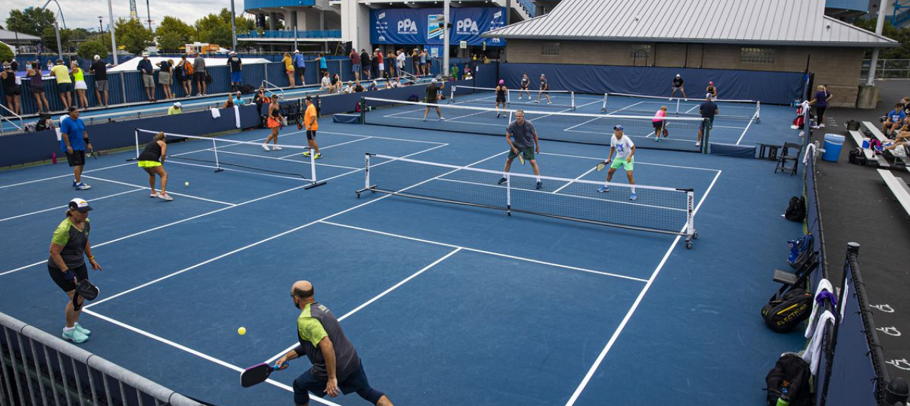

<div align="center">
  
  <h1>Punchshot Pickleball</h1>
  <p><strong>Find your league. Build your team. Get on the court.</strong></p>
  <p>A league management platform for the Atlanta pickleball community.</p>
  <p><strong>React 18 · Material UI · Node.js · Express · MongoDB</strong></p>
  <p>
    <a href="#features">Features</a> ·
    <a href="#local-setup">Local setup</a> ·
    <a href="#integrations">Integrations</a> ·
    <a href="#project-structure">Project structure</a>
  </p>
</div>



Punchshot brings league discovery, team coordination, and match results into one place. Players can browse leagues by skill level and division, request a spot on a team, and follow their standings throughout the season. Organizers can create leagues, manage registration, and coordinate teams and match play.

## Features

| Area | What’s inside |
| --- | --- |
| **League discovery** | Search by league name, filter by skill level and division, and look up private leagues using an access code. |
| **League organization** | Set season dates, registration deadlines, playing areas, and match times. |
| **Team management** | Create teams, handle join requests, assign home courts, and transfer captaincy. |
| **Matches & standings** | View match schedules, enter scores, and compare team wins, losses, and sets on the leaderboard. |
| **Player accounts** | Sign up, log in, update passwords, and personalize profiles with photos. |

Location tools, email notifications, profile photos, and invoicing use the external services described under [Integrations](#integrations).

## Local setup

You’ll need **Node.js and npm**, a **running MongoDB instance or MongoDB Atlas connection**, and a **Stripe test-mode API key**. The repository does not pin a Node.js version.

> **Before starting the API:** the current server calls `sendInvoice()` on startup without a recipient. With a valid Stripe key, this can create billing objects and attempt to send an invoice. Use test-mode credentials and a development database; an invoice error may appear independently of the database connection.

### 1. Clone and install

```bash
git clone https://github.com/PunchShotLLC/Punchshot-Pickleball.git
cd Punchshot-Pickleball
npm --prefix frontend install
npm --prefix backend install
```

The frontend and backend have separate dependency lists. No root-level install is needed to run them.

### 2. Configure the backend

Create `backend/.env`:

```dotenv
DATABASE=mongodb://127.0.0.1:27017/PunchshotPickleball
JWT_SECRET=replace-with-a-long-random-secret
STRIPE_KEY=replace-with-your-stripe-test-secret-key
```

Use your Atlas connection string instead of the local `DATABASE` value if needed. Replace both secret placeholders before starting. `STRIPE_KEY` is required because the payment controller initializes Stripe when it is imported.

To generate a value for `JWT_SECRET`:

```bash
node -e "console.log(require('crypto').randomBytes(32).toString('hex'))"
```

`backend/.env` is already ignored by Git. Add the optional service credentials from [Integrations](#integrations) when you need those features.

### 3. Start the API

In a terminal at the repository root:

```bash
cd backend
node server.js
```

The API listens at **[localhost:8000](http://localhost:8000)**. Look for `DB connected` to confirm MongoDB is available.

### 4. Start the frontend

In a second terminal at the repository root:

```bash
cd frontend
npm start
```

Open **[localhost:3000](http://localhost:3000)**. Keep both terminals running. The frontend API URLs and backend CORS configuration currently expect ports **3000** and **8000**.

### 5. Check the connection

```bash
curl http://localhost:8000/
```

Expected response:

```json
{"mssg":"Welcome!"}
```

This confirms the HTTP server is responding; check the API terminal separately for the MongoDB connection. Use **Login/Signup** in the app to create a player account. A new database starts without leagues; no seed script is included.

**Creating your first local league:** register a development account with the username `ADMIN_PUNCHSHOT`, which the current UI checks before showing **Create League**. Configure the map keys below, then open **Leagues → Create League**. League creation also hardcodes the owner and owner email in [`CreateLeague.js`](frontend/src/components/LeagueComp/CreateLeague.js); change the owner email to your test address before exercising notifications.

## Integrations

| Service | Configuration | Used for |
| --- | --- | --- |
| **MongoDB** | `DATABASE` in `backend/.env` | Users, leagues, teams, and match data. |
| **Stripe** | `STRIPE_KEY` in `backend/.env` | Entry-fee invoicing; also initialized during API startup. Use a test-mode key locally. |
| **Google Maps** | `GOOGLE` in `backend/.env`, plus browser key placeholders | Maps, address lookup, geocoding, and court distance checks. |
| **SendGrid** | `SENDGRID` in `backend/.env` | Team requests, captain changes, and scheduled league notifications. |
| **Amazon S3** | `AWS_ACCESS_KEY_ID`, `AWS_ACCESS_KEY_SECRET`, `AWS_BUCKET_NAME` in `backend/.env` | Profile photo uploads and retrieval. |

<details>
<summary><strong>Configure maps, email, and profile photos</strong></summary>

Add the credentials for the services you plan to use to `backend/.env`:

```dotenv
GOOGLE=your-google-api-key
SENDGRID=your-sendgrid-api-key
AWS_ACCESS_KEY_ID=your-aws-access-key-id
AWS_ACCESS_KEY_SECRET=your-aws-secret-access-key
AWS_BUCKET_NAME=your-profile-photo-bucket
```

**Maps:** setting `GOOGLE` only configures the backend. The browser also has empty key placeholders in these files:

- [`MapWithCircle.js`](frontend/src/components/LeagueComp/MapWithCircle.js): `GOOGLE_MAPS_API_KEY`.
- [`CreateLeague.js`](frontend/src/components/LeagueComp/CreateLeague.js): the `setDefaults({ key: "" })` value.
- [`team.js`](frontend/src/pages/Team/team.js): the `setDefaults({ key: "" })` value.

Configure a browser key restricted to your development origin and enable the Google APIs used by these components. The backend uses the Places autocomplete and Distance Matrix endpoints in [`leagueController.js`](backend/controllers/leagueController.js).

**Email:** the sender address is hardcoded in the `sendEmail` helper in [`leagueController.js`](backend/controllers/leagueController.js). Update it to a sender verified in your SendGrid account. Scheduled notification jobs run while the API is running.

**Profile photos:** provide S3 credentials with access to the configured bucket. The current upload route accepts JPEG images.

</details>

## Project structure

```text
Punchshot-Pickleball/
├── frontend/
│   ├── public/              # HTML shell and public assets
│   ├── src/
│   │   ├── assets/          # Brand artwork and images
│   │   ├── components/      # Shared UI, authentication, and league forms
│   │   ├── pages/           # Home, leagues, teams, matches, and profiles
│   │   └── index.js         # React entry point and browser routes
│   └── package.json
├── backend/
│   ├── controllers/        # Accounts, leagues, scheduling, and payments
│   ├── models/             # Mongoose schemas
│   ├── routes/             # Express route definitions
│   ├── util/               # JWT helpers
│   ├── server.js           # Database connection and API startup
│   └── package.json
└── README.md
```

The React client talks to the Express API, which stores application data in MongoDB through Mongoose. Authentication uses bcrypt password hashing and JWT cookies. The active API route groups are `/users` and `/leagues`; tournament files are present but their router is not mounted in `server.js`.

## Development notes

| Task | Command from the repository root |
| --- | --- |
| Start the frontend | `npm --prefix frontend start` |
| Start the API | `cd backend && node server.js` |
| Build the frontend | `npm --prefix frontend run build` |
| Open the frontend test runner | `npm --prefix frontend test` |

The frontend build is written to `frontend/build/`. Run the API from `backend/` so `dotenv` finds the correct `.env` file.

**Current test coverage:** the frontend still contains the Create React App starter test, which does not reflect the application. The backend test script is a placeholder that exits with an error. Neither is a working application test suite.

<details>
<summary><strong>Troubleshooting local setup</strong></summary>

| Symptom | What to check |
| --- | --- |
| Stripe reports a missing API key on startup | Replace the `STRIPE_KEY` placeholder and start the API from `backend/`. |
| `DB connection error` in the API terminal | Check `DATABASE`, start your local MongoDB service, or verify your Atlas credentials and network access. |
| Login or league requests cannot reach the API | Keep the backend on port `8000` and the frontend on `3000`; both addresses are currently hardcoded. |
| Maps are blank or address lookup fails | Configure both the backend `GOOGLE` value and the browser key placeholders listed above. |
| Email or profile photos fail | Check the relevant service credentials, the SendGrid sender, and S3 bucket access. |

</details>
